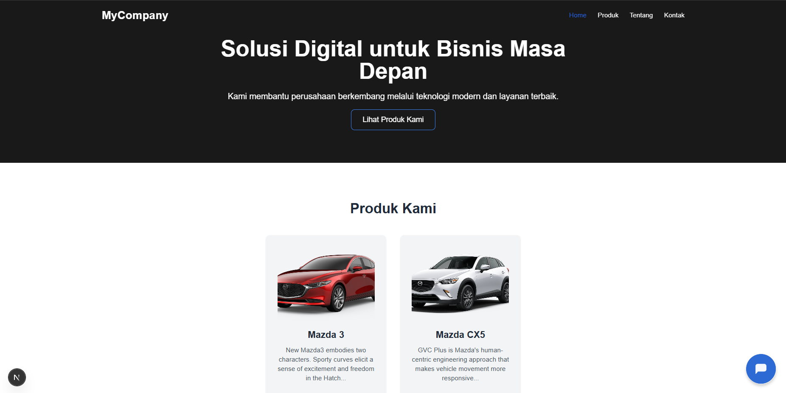

```markdown
🏢 Company Profile Website

This is a responsive and modern *Company Profile* website built using *Next.js*, *React*, and *Tailwind CSS*. Designed for companies that want a clean and functional web presence with fast performance and easy deployment.

 <!-- Ganti dengan gambar screenshot jika ada -->

---

🚀 Features

- ⚡ Fast and optimized with Next.js
- 💬 Integrated chatbot using Botpress
- 🧭 Smooth navigation with Expo Router-style structure
- 🛍️ Product previews linked to Tokopedia / Shopee
- 📱 Fully responsive (mobile + desktop)
- ✨ Animations and transitions with Framer Motion
- 📧 Contact form (email/WhatsApp integration)

---

📁 Project Structure

```

├── app/
│   ├── \_layout.tsx        # Main layout with navigation
│   ├── (tabs)/\_layout.tsx # Tab navigation layout
│   ├── home/              # Home page
│   ├── about/             # About page
│   ├── product/           # Product page
│   └── contact/           # Contact page
├── components/            # Reusable components (Navbar, Footer, etc.)
├── public/                # Static assets
├── styles/                # Global styles
├── .gitignore
├── package.json
└── README.md

````

---

🛠️ Tech Stack

- **Next.js** – React framework for SSR & static web apps
- **Tailwind CSS** – Utility-first CSS for rapid UI development
- **Botpress** – AI chatbot integration
- **Framer Motion** – Smooth page transitions and animations
- **TypeScript** – Static typing for safer code

---

📦 Installation

```bash
Clone the repo
git clone https://github.com/Vinez666/CompanyProfile.git

Navigate to project directory
cd CompanyProfile

Install dependencies
npm install

Start development server
npm run dev
````

---

🌐 Deployment

This project is ready for deployment on **Vercel**.

```bash
# Build for production
npm run build

# Start production server
npm start
```

> Or simply connect your GitHub repo to [vercel.com](https://vercel.com) and deploy automatically on push.

---

📬 Contact

Need help or want to contribute?

* 📧 Email: [your.email@example.com](mailto:your.email@example.com)
* 💬 WhatsApp: +62xxxxxxxxxx
* 🌐 Website: [yourcompanysite.com](https://yourcompanysite.com)

---

📄 License

This project is open-source and available under the [MIT License](LICENSE).

```

---

✅ Petunjuk Lanjutan

- Simpan file ini sebagai `README.md` di root proyek kamu.
- Kalau kamu punya **screenshot website**, letakkan di `public/preview.png` dan aktifkan bagian ``.
- Ubah bagian kontak sesuai data kamu.

---

